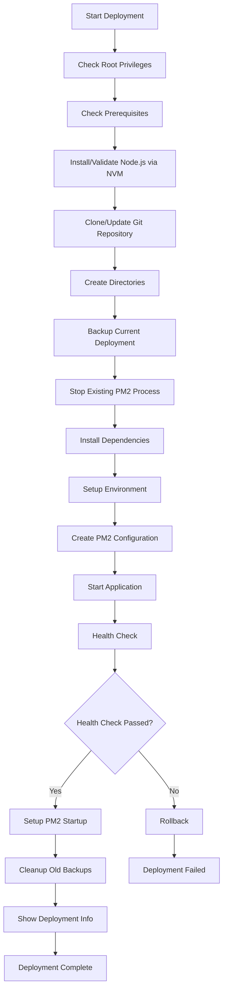

# CloudPanel API Node.js

[](https://opensource.org/licenses/MIT)
[](https://nodejs.org/)
[](https://github.com/iamfafakkk/cloudpanel-api.git)

A comprehensive Node.js API wrapper for CloudPanel CLI commands. This RESTful API provides programmatic access to all CloudPanel server management operations, making it easy to integrate CloudPanel functionality into your applications and automation workflows.

## 🚀 Automated Deployment with PM2

The project includes a comprehensive deployment script (`deploy.sh`) that automates the entire deployment process using PM2 process manager with advanced features for production environments.

### 📦 Deployment Features

- ✅ **Automated Git Integration** - Clone or update from repository
- ✅ **Node.js Management** - Automatic installation via NVM (Node.js 22+)
- ✅ **PM2 Process Management** - Clustering and zero-downtime deployments
- ✅ **Interactive Configuration** - Port and API key setup with validation
- ✅ **Backup & Rollback** - Automatic backup creation and rollback on failure
- ✅ **Health Monitoring** - Built-in health checks and status monitoring
- ✅ **Prerequisites Validation** - Automatic dependency checking and installation
- ✅ **Root Privilege Management** - Designed for secure root deployment

### 🔧 Quick Deployment

#### One-Command Production Deployment

```bash
# Download and run deployment script
curl -o deploy.sh https://raw.githubusercontent.com/iamfafakkk/cloudpanel-api/main/deploy.sh
chmod +x deploy.sh

# Run full deployment (requires root)
sudo ./deploy.sh
```

#### Available Deployment Commands

| Command | Description | Example |
|---------|-------------|---------|
| `(no args)` | Full deployment process | `sudo ./deploy.sh` |
| `start` | Start the application | `sudo ./deploy.sh start` |
| `stop` | Stop the application | `sudo ./deploy.sh stop` |
| `restart` | Restart the application | `sudo ./deploy.sh restart` |
| `reload` | Zero-downtime reload | `sudo ./deploy.sh reload` |
| `update` | Update from Git and reload | `sudo ./deploy.sh update` |
| `logs` | Show application logs | `sudo ./deploy.sh logs` |
| `status` | Show PM2 status | `sudo ./deploy.sh status` |
| `health` | Check application health | `sudo ./deploy.sh health` |
| `backup` | Create manual backup | `sudo ./deploy.sh backup` |
| `help` | Show help message | `sudo ./deploy.sh help` |

### 🏗️ Deployment Architecture

#### Directory Structure
```
/root/cloudpanel-api/          # Main application directory
├── src/                       # Source code
├── logs/                      # Application logs
├── node_modules/              # Dependencies
├── .env                       # Environment configuration
├── ecosystem.config.js        # PM2 configuration
└── package.json               # Project metadata

/root/backup/cloudpanel-api/   # Backup directory
├── cloudpanel-api-backup-20250608_120000.tar.gz
├── cloudpanel-api-backup-20250608_110000.tar.gz
└── ... (keeps last 10 backups)
```

#### PM2 Configuration
The script generates an optimized PM2 ecosystem configuration:

```javascript
module.exports = {
  apps: [{
    name: 'cloudpanel-api',
    script: 'src/index.js',
    instances: 'max',              // Use all CPU cores
    exec_mode: 'cluster',          // Cluster mode for scalability
    env: {
      NODE_ENV: 'production',
      PORT: 3000
    },
    error_file: 'logs/pm2-error.log',
    out_file: 'logs/pm2-out.log',
    log_file: 'logs/pm2-combined.log',
    time: true,                    // Add timestamps to logs
    max_memory_restart: '1G',      // Restart if memory exceeds 1GB
    node_args: '--max-old-space-size=1024',
    watch: false,                  // Disable file watching in production
    restart_delay: 1000,           // Delay between restarts
    max_restarts: 10,              // Maximum restart attempts
    min_uptime: '10s',             // Minimum uptime before considering stable
    kill_timeout: 5000,            // Time to wait before killing process
    wait_ready: true,              // Wait for ready signal
    listen_timeout: 3000           // Timeout for listen event
  }]
}
```

### ⚙️ Interactive Environment Configuration

The deployment script provides interactive configuration for critical settings:

#### Port Configuration
- Validates port range (1-65535)
- Checks if port is already in use
- Allows overriding port conflicts with confirmation

#### API Key Configuration
Three options available:
1. **Auto-generate** - Creates secure 64-character random API key
2. **Manual entry** - Enter custom API key
3. **Keep existing** - Retain current API key (if available)

#### Configuration Example
```bash
=== Environment Configuration ===
Please provide the following configuration values:

Current configuration:
Port: 3000
API Key: not configured

Enter the application port (current: 3000): 8080
API Key options:
1. Generate a secure random API key (recommended)
2. Enter your own API key
Choose an option (1-2): 1
Generated API key: a1b2c3d4e5f6...

=== Configuration Summary ===
Port: 8080
API Key: a1b2c3d4... (truncated for security)

Proceed with this configuration? (Y/n): Y
```

### 🔄 Deployment Workflow



### 🛡️ Error Handling & Rollback

#### Automatic Rollback
The script implements automatic rollback on deployment failure:

1. **Error Detection** - Uses `trap 'rollback' ERR` to catch failures
2. **Process Cleanup** - Stops failed PM2 processes
3. **Backup Restoration** - Restores from latest backup
4. **Service Recovery** - Restarts application with previous version

#### Backup Management
- **Automatic Backups** - Created before each deployment
- **Retention Policy** - Keeps last 10 backups automatically
- **Manual Backups** - Available via `sudo ./deploy.sh backup`
- **Backup Contents** - Excludes node_modules, logs, and .git directories

### 🔍 Health Monitoring

#### Health Check Process
```bash
# Automatic health check after deployment
curl -sf "http://localhost:$PORT/health"

# Manual health check
sudo ./deploy.sh health
```

#### Health Check Features
- **Multiple Attempts** - 30 attempts with 2-second intervals
- **Timeout Handling** - 60-second total timeout
- **Failure Logging** - Shows PM2 logs on failure
- **Status Reporting** - Clear success/failure indication

### 🔧 PM2 Management Commands

```bash
# Process Management
pm2 list                    # Show all processes
pm2 start cloudpanel-api    # Start application
pm2 stop cloudpanel-api     # Stop application
pm2 restart cloudpanel-api  # Restart application
pm2 reload cloudpanel-api   # Zero-downtime reload
pm2 delete cloudpanel-api   # Delete process

# Monitoring
pm2 logs cloudpanel-api     # Show logs
pm2 monit                   # Real-time monitoring
pm2 show cloudpanel-api     # Detailed process info

# Configuration
pm2 save                    # Save current process list
pm2 startup                 # Generate startup script
pm2 unstartup               # Remove startup script
```

### 🚨 Troubleshooting Deployment

#### Common Issues and Solutions

##### 1. Permission Denied
```bash
Error: This script must be run as root
Solution: Use sudo ./deploy.sh
```

##### 2. Node.js Version Issues
```bash
Error: Node.js version below required version 22
Solution: Script automatically installs Node.js 22 via NVM
```

##### 3. Port Already in Use
```bash
Warning: Port 3000 is currently in use
Solution: Choose different port or confirm override
```

##### 4. Git Repository Issues
```bash
Error: Git clone/pull failed
Solution: Check repository URL and network connectivity
```

##### 5. Health Check Failures
```bash
Error: Health check failed after 30 attempts
Solution: Check application logs via pm2 logs cloudpanel-api
```

#### Debug Commands
```bash
# Check PM2 status
pm2 list

# View detailed logs
pm2 logs cloudpanel-api --lines 50

# Monitor real-time
pm2 monit

# Check process details
pm2 show cloudpanel-api

# Restart with verbose logging
NODE_ENV=development pm2 restart cloudpanel-api
```

### 📋 Deployment Prerequisites

The script automatically checks and installs the following dependencies:
- Git
- Node.js 22+ (installed via NVM)
- npm
- PM2
- curl (for health checks)
- CloudPanel CLI (optional, with warning if not found)

### 🔐 Security Considerations

#### Root Privileges
- **Required for Deployment** - Script must run as root for `/root/` directory access
- **Privilege Validation** - Checks for root privileges before execution
- **Secure Defaults** - API key auto-generation uses secure random methods

#### API Key Security
```bash
# Auto-generation methods (in order of preference):
1. openssl rand -hex 32          # 64-character hex string
2. /dev/urandom + tr             # Fallback method

# Security features:
- Truncated display in logs (first 8 characters only)
- No echo during manual entry
- Validation for empty keys
```

### 🔄 Continuous Deployment

#### CI/CD Integration Example
```yaml
# Example GitHub Actions workflow
name: Deploy CloudPanel API
on:
  push:
    branches: [main]

jobs:
  deploy:
    runs-on: ubuntu-latest
    steps:
      - name: Deploy to server
        run: |
          ssh root@your-server "cd /root/cloudpanel-api && ./deploy.sh update"
```

#### Automated Updates
```bash
# Set up automatic updates (optional)
# Add to crontab for daily updates
0 2 * * * /root/cloudpanel-api/deploy.sh update >> /var/log/cloudpanel-api-update.log 2>&1
```

---

## ✨ Features

- 🌐 **Cloudflare Management**: Update and sync IP addresses
- 🔐 **CloudPanel Security**: Enable/disable basic authentication
- 🗄️ **Database Operations**: Create, import, export, and manage databases
- 🔒 **SSL/TLS Certificates**: Install Let's Encrypt and custom certificates
- 🌍 **Site Management**: Deploy Node.js, PHP, Python, static sites, and reverse proxies
- 👥 **User Administration**: Complete user lifecycle management
- 📋 **Vhost Templates**: Custom template management and deployment
- 🚧 **Laravel Setup**: One-click Laravel site creation with PHP and database setup
- ⚡ **Smart Confirmation Handling**: Automatic handling of CLI confirmation prompts (no more hanging commands!)
- 🔄 **Force Mode Support**: Optional force mode for deletion operations
- 🚀 **Production Ready**: Built for automated deployment and CI/CD workflows

## 🚀 Quick Start

### Prerequisites
- Node.js 18+ installed
- CloudPanel installed on your server
- CloudPanel CLI (`clpctl`) available in PATH

### Installation

```bash
# Clone the repository
git clone https://github.com/iamfafakkk/cloudpanel-api.git
cd cloudpanel-api

# Install dependencies
npm install

# Set up environment
cp .env.example .env
# Edit .env with your configuration

# Start development server
npm run dev
```

### Docker Installation

```bash
# Clone the repository
git clone https://github.com/iamfafakkk/cloudpanel-api.git
cd cloudpanel-api

# Start with Docker Compose
docker-compose up -d
```

## 📖 API Documentation

### Base URL
```
http://localhost:3000/api
```

### Authentication
```bash
# Include API key in headers (when enabled)
curl -H "X-API-Key: your-api-key" http://localhost:3000/api/endpoint
```

### 🌐 Cloudflare Endpoints
| Method | Endpoint | Description |
|--------|----------|-------------|
| `POST` | `/cloudflare/update-ips` | Update Cloudflare IP addresses |

### 🔐 CloudPanel Security
| Method | Endpoint | Description |
|--------|----------|-------------|
| `POST` | `/cloudpanel/basic-auth/enable` | Enable basic authentication |
| `DELETE` | `/cloudpanel/basic-auth/disable` | Disable basic authentication |

### 🗄️ Database Management
| Method | Endpoint | Description |
|--------|----------|-------------|
| `GET` | `/database/master-credentials` | Get master database credentials |
| `POST` | `/database/add` | Create new database |
| `POST` | `/database/export` | Export database |
| `POST` | `/database/import` | Import database |

### 🔒 SSL/TLS Certificates  
| Method | Endpoint | Description |
|--------|----------|-------------|
| `POST` | `/letsencrypt/install` | Install Let's Encrypt certificate |

### 🌍 Site Management
| Method | Endpoint | Description |
|--------|----------|-------------|
| `POST` | `/site/add/nodejs` | Create Node.js application site |
| `POST` | `/site/add/php` | Create PHP website |
| `POST` | `/site/add/python` | Create Python application site |
| `POST` | `/site/add/static` | Create static website |
| `POST` | `/site/add/reverse-proxy` | Create reverse proxy site |
| `DELETE` | `/site/delete` | Delete existing site |

### 🚧 Laravel Setup
| Method | Endpoint | Description |
|--------|----------|-------------|
| `POST` | `/setup` | One-click Laravel site creation with PHP and database setup |

### 👤 User Management
| Method | Endpoint | Description |
|--------|----------|-------------|
| `GET` | `/user/list` | List all users |
| `POST` | `/user/add` | Create new user |
| `DELETE` | `/user/delete` | Delete user |
| `POST` | `/user/reset-password` | Reset user password |
| `POST` | `/user/enable-2fa` | Enable two-factor authentication |
| `DELETE` | `/user/disable-2fa` | Disable two-factor authentication |

### 📄 Vhost Template Management
| Method | Endpoint | Description |
|--------|----------|-------------|
| `GET` | `/vhost-template/list` | List available templates |
| `POST` | `/vhost-template/import` | Import new template |
| `POST` | `/vhost-template/add` | Create custom template |
| `DELETE` | `/vhost-template/delete` | Delete template |
| `GET` | `/vhost-template/view` | View template content |
## 📊 Monitoring

The API provides built-in monitoring capabilities:

### Health Check
```bash
curl http://localhost:3000/health
```

### Server Statistics
```bash
curl http://localhost:3000/api/monitor
```

Returns detailed server metrics including:
- Uptime information
- Memory usage statistics
- Process information
- Environment details

### Live API Documentation
```bash
curl http://localhost:3000/api/docs
```

## 🧪 Testing

### Run Test Suite
```bash
npm test
```

### API Integration Testing
```bash
# Make test script executable
chmod +x test-api.sh

# Run comprehensive API tests
./test-api.sh
```

The test script includes:
- Core endpoint validation
- Input validation testing
- Error handling verification
- Rate limiting checks
- Mock CloudPanel operations

## 🔧 Configuration

### Environment Variables

Create a `.env` file in the project root:

```bash
# Server Configuration
NODE_ENV=development
PORT=3000

# CloudPanel Configuration
CLPCTL_PATH=clpctl

# Security (optional)
API_KEY=your-secure-api-key-here
RATE_LIMIT_WINDOW_MS=900000
RATE_LIMIT_MAX_REQUESTS=100

# Logging
LOG_LEVEL=info
```

### Security Features

- **API Key Authentication**: Optional but recommended for production
- **Rate Limiting**: Configurable request throttling
- **Input Validation**: Joi schema validation for all endpoints
- **Security Headers**: Helmet.js security middleware
- **CORS Support**: Configurable cross-origin policies

## 📚 Documentation

- **[API Examples](EXAMPLES.md)**: Complete usage examples with curl commands
- **[Deployment Guide](DEPLOYMENT.md)**: Production deployment instructions
- **[Project Status](PROJECT_STATUS.md)**: Development progress and features

## 🐳 Docker Deployment

### Using Docker Compose
```bash
docker-compose up -d
```

### Manual Docker Build
```bash
docker build -t cloudpanel-api .
docker run -p 3000:3000 cloudpanel-api
```

## 📋 API Usage Examples

### Create a Node.js Site
```bash
curl -X POST http://localhost:3000/api/site/add/nodejs \
  -H "Content-Type: application/json" \
  -d '{
    "domainName": "myapp.com",
    "nodejsVersion": 20,
    "appPort": 3000,
    "siteUser": "myuser",
    "siteUserPassword": "securepass123"
  }'
```

### Install SSL Certificate
```bash
curl -X POST http://localhost:3000/api/letsencrypt/install \
  -H "Content-Type: application/json" \
  -d '{
    "domainNames": ["myapp.com", "www.myapp.com"],
    "email": "admin@myapp.com"
  }'
```

### Add Database
```bash
curl -X POST http://localhost:3000/api/database/add \
  -H "Content-Type: application/json" \
  -d '{
    "domainName": "myapp.com",
    "databaseName": "myapp_db",
    "databaseUserName": "dbuser",
    "databaseUserPassword": "dbpass123"
  }'
```

## 🤝 Contributing

1. Fork the repository
2. Create your feature branch (`git checkout -b feature/amazing-feature`)
3. Commit your changes (`git commit -m 'Add some amazing feature'`)
4. Push to the branch (`git push origin feature/amazing-feature`)
5. Open a Pull Request

## 📝 License

This project is licensed under the MIT License - see the [LICENSE](LICENSE) file for details.

## 🆘 Support

- **GitHub Issues**: [Create an issue](https://github.com/iamfafakkk/cloudpanel-api/issues)
- **Documentation**: Check the docs in this repository
- **CloudPanel Docs**: [Official CloudPanel Documentation](https://www.cloudpanel.io/docs/)

## 🙏 Acknowledgments

- [CloudPanel](https://cloudpanel.io/) for providing the excellent server management platform
- The Node.js and Express.js communities for the robust ecosystem
- All contributors who help improve this project

---

**Made with ❤️ for the CloudPanel community**
- `POST /api/user/reset-password` - Reset password
- `POST /api/user/disable-mfa` - Disable 2FA

### Vhost Templates
- `POST /api/vhost-templates/import` - Import templates
- `GET /api/vhost-templates/list` - List templates
- `POST /api/vhost-templates/add` - Add template
- `DELETE /api/vhost-templates/delete` - Delete template
- `GET /api/vhost-templates/view` - View template

## Environment Variables

```bash
PORT=3000
NODE_ENV=development
```

## Security

- CORS enabled
- Helmet security headers
- Rate limiting
- Input validation with Joi

## 📊 Monitoring

The API provides built-in monitoring capabilities:

### Health Check
```bash
curl http://localhost:3000/health
```

### Server Statistics
```bash
curl http://localhost:3000/api/monitor
```

Returns detailed server metrics including:
- Uptime information
- Memory usage statistics
- Process information
- Environment details

## 🧪 Testing

### Run Test Suite
```bash
npm test
```

### API Integration Testing
```bash
# Make test script executable
chmod +x test-api.sh

# Run comprehensive API tests
./test-api.sh
```

The test script includes:
- Core endpoint validation
- Input validation testing
- Error handling verification
- Rate limiting checks
- Mock CloudPanel operations

## License

MIT
